## Proyecto Final de Bootcamp DevOps: Avatares 🚀

### Descripción del Proyecto:
Avatares es un proyecto de muestra diseñado para demostrar el uso de contenedores en un entorno DevOps. Consiste en un backend de API web en Python 3.10 para generar avatares y un frontend de SPA (aplicación de página única) en Node.js 18. El objetivo de este proyecto es aplicar prácticas y herramientas de DevOps para mejorar la calidad, rendimiento, seguridad y eficiencia operativa de la aplicación.


Más Información: [Enlace](./ABOUT.md)

#### Componentes del Proyecto:
1. **Backend de API (Python 3.10):**
   - El backend de la API está desarrollado en Python 3.10 utilizando un framework web como Flask.
   - carpeta /api
   - Codigo principal app.py
   - Requiere dos variables de entorno
   ```
   FLASK_APP=app.py
   FLASK_ENV=development
   ```
   - La API proporciona endpoints para generar avatares basados en diferentes parámetros de entrada.
   - Metodos GET:
   ```
   /api/avatar
   /api/avatar/spec
   /ready
   ```

2. **Frontend SPA (Node.js 18):**
   - El frontend es una aplicación de página única (SPA) desarrollada en Node.js 18 utilizando un framework como React+vite.
   - Carpeta web/
   - Requiere dos variables de entorno
    ```
    VITE_HOST=0.0.0.0
    VITE_PORT=5173
    ```
   - Usar el gestor de paquetes npm
   - El frontend se comunica con el backend a través de solicitudes HTTP para generar y mostrar avatares.

#### Objetivos DevOps:
El objetivo principal es implementar un flujo de trabajo DevOps completo para el proyecto Avatares. Esto incluye:


1. **Infraestructura como Código (IaC) con Terraform:**
   - Utilizar Terraform para definir y aprovisionar la infraestructura necesaria, como servidores, cluster, redes, bases de datos, etc.
   - Usar AWS ó Localstack

2. **Continuous Integration / Continuous Deployment (CI/CD):**
   - Configurar un pipeline de CI/CD utilizando herramientas como Jenkins, GitLab CI, o GitHub Actions.
   - Implementar despliegues automatizados del backend y frontend en entornos de desarrollo y producción.

3. **Contenedores:**
   - Utilizar contenedores Docker para empaquetar y distribuir la aplicación backend y frontend, junto con todas sus dependencias.
   - Definir Dockerfiles para construir imágenes de contenedor optimizadas y seguras.
   - Utilizar Docker Compose para orquestar contenedores en entornos locales de desarrollo y pruebas.
   - Subir las imagenes al Registry de Docker-Hub

4. **Orquestación de Contenedores con Kubernetes:**
   - Implementar Kubernetes para orquestar y administrar los contenedores en un entorno de producción.
   - Definir y desplegar manifestos de Kubernetes (archivos YAML) para desplegar y escalar la aplicación en clústeres de Kubernetes.
   - Pueden usar Minikube/k3s/K0s/Killercoda/AWS-EKS

5. **Observabilidad:**
   - Implementar herramientas de observabilidad como Prometheus para la recopilación de métricas, Grafana para la visualización de métricas.
   - Configurar paneles de control en Grafana para monitorear el rendimiento de la aplicación, la utilización de recursos y la salud del clúster de Kubernetes.

6. **Buenas Prácticas:**
   - Aplicar prácticas de seguridad.
   - Implementar estrategias de gestión de configuración para mantener la configuración de la aplicación separada del código fuente.
   - Utilizar GitFlow para gestionar el flujo de código y versionado de la aplicación.

#### Entregables del Proyecto:
- Repositorio de código en un sistema de control de versiones como GitHub, GitLab o Bitbucket.
- Documentación detallada que describa la arquitectura del proyecto, la configuración de la infraestructura, los pasos de implementación de DevOps y las prácticas seguidas.
- Pipeline de CI/CD configurado y funcionando para el despliegues.
- Infraestructura aprovisionada y administrada mediante Terraform.
- Aplicación desplegada y ejecutándose correctamente en un clúster de Kubernetes.
- Herramientas de observabilidad configuradas y proporcionando información útil sobre el estado y rendimiento de la aplicación.

# Trabajo a Presentar

1. **Infraestructura como Código (IaC) con Terraform:**
Archivo: ***main.tf***

*En este caso se utilizo LocalStack para simular el funcionamiento de terraform en un servicio ECS, ya que EKS era pago. En primer lugar se establece el proveedor AWS, estableciendo la region, la clave y credenciales. Se establece el servicio ECS en el purto 4566.*
```
provider "aws" {
  region                      = "us-east-1"
  access_key                  = "clave_secreta"
  secret_key                  = "clave_secreta"
  skip_credentials_validation = true
  skip_metadata_api_check     = true
  skip_requesting_account_id  = true
  endpoints {
    ecs = "http://localhost:4566"
  }
}
```
*Luego se establece un proveedor de docker para poder intectuar con los contenedores e imagenes de Docker*
```
terraform {
  required_providers {
    docker = {
      source  = "kreuzwerker/docker"
      version = "3.0.2"
    }
  }
}

provider "docker" {}

```
*Una vez se descarga la imagen pre-cargada en DockerHUB con la imagen de la API, en el cual se le configura el puerto a utilizar y enviando las variables de entorno para su funcionamiento*
```
resource "docker_image" "api" {
  name = "lsmcba/api:1.0"
}

resource "docker_container" "api" {
  name  = "api"
  image = docker_image.api.image_id
  ports {
    internal = 80
    external = 80
  }

  env = [
    "FLASK_APP=app.py",
    "FLASK_ENV=development"
  ]
}

```
*Tambien se descarga de DockerHUB la imagen pre-cargada de la WEB, en el cual se configura el puerto y la trabajar. En este caso se establece una dependencia de funcionamiento con el contenedor API creado anteriormente*
```
resource "docker_image" "web" {
  name = "lsmcba/web:1.0"
}

resource "docker_container" "web" {
  name  = "web"
  image = docker_image.web.image_id
  ports {
    internal = 5173
    external = 5173
  }

  env = [
    "VITE_HOST=0.0.0.0",
    "VITE_PORT=5173"
  ]

  depends_on = [docker_container.api]
}
```
#### Este ejemplo tenia contenedores para el uso de Grafana y Prometheus para obtener metricas de los contenedores, pero no era aplicable aca, por no usar servicios EKS de AWS o LocalStack. La información esta en el archivo "*main.tf.old*". El uso del mismo se mostrara en la demostracion de Kubernetes local.
 --------------------

**Demostración**

*Inicializamos primero terraform*
```
$ terraform init                   

Initializing the backend...

Initializing provider plugins...
- Reusing previous version of kreuzwerker/docker from the dependency lock file
- Reusing previous version of hashicorp/aws from the dependency lock file
- Using previously-installed kreuzwerker/docker v3.0.2
- Using previously-installed hashicorp/aws v5.57.0

Terraform has been successfully initialized!
```
*Creamos plan de ejecución, el cual nos mostrara la tarea que va a realizar*
```
$ terraform plan 

Terraform will perform the following actions:

  # docker_container.api will be created
  + resource "docker_container" "api" {
      + attach                                      = false
      + bridge                                      = (known after apply)
      + command                                     = (known after apply)
      + container_logs                              = (known after apply)
      + container_read_refresh_timeout_milliseconds = 15000
      + entrypoint                                  = (known after apply)
      + env                                         = [
          + "FLASK_APP=app.py",
          + "FLASK_ENV=development",
        ]
      + exit_code                                   = (known after apply)
      + hostname                                    = (known after apply)
      + id                                          = (known after apply)
      + image                                       = (known after apply)
      + init                                        = (known after apply)
      + ipc_mode                                    = (known after apply)
      + log_driver                                  = (known after apply)
      + logs                                        = false
      + must_run                                    = true
      + name                                        = "api"
      + network_data                                = (known after apply)
      + read_only                                   = false
      + remove_volumes                              = true
      + restart                                     = "no"
      + rm                                          = false
      + runtime                                     = (known after apply)
      + security_opts                               = (known after apply)
      + shm_size                                    = (known after apply)
      + start                                       = true
      + stdin_open                                  = false
      + stop_signal                                 = (known after apply)
      + stop_timeout                                = (known after apply)
      + tty                                         = false
      + wait                                        = false
      + wait_timeout                                = 60

      + ports {
          + external = 80
          + internal = 80
          + ip       = "0.0.0.0"
          + protocol = "tcp"
        }
    }

  # docker_container.web will be created
  + resource "docker_container" "web" {
      + attach                                      = false
      + bridge                                      = (known after apply)
      + command                                     = (known after apply)
      + container_logs                              = (known after apply)
      + container_read_refresh_timeout_milliseconds = 15000
      + entrypoint                                  = (known after apply)
      + env                                         = [
          + "VITE_HOST=0.0.0.0",
          + "VITE_PORT=5173",
        ]
      + exit_code                                   = (known after apply)
      + hostname                                    = (known after apply)
      + id                                          = (known after apply)
      + image                                       = (known after apply)
      + init                                        = (known after apply)
      + ipc_mode                                    = (known after apply)
      + log_driver                                  = (known after apply)
      + logs                                        = false
      + must_run                                    = true
      + name                                        = "web"
      + network_data                                = (known after apply)
      + read_only                                   = false
      + remove_volumes                              = true
      + restart                                     = "no"
      + rm                                          = false
      + runtime                                     = (known after apply)
      + security_opts                               = (known after apply)
      + shm_size                                    = (known after apply)
      + start                                       = true
      + stdin_open                                  = false
      + stop_signal                                 = (known after apply)
      + stop_timeout                                = (known after apply)
      + tty                                         = false
      + wait                                        = false
      + wait_timeout                                = 60

      + ports {
          + external = 5173
          + internal = 5173
          + ip       = "0.0.0.0"
          + protocol = "tcp"
        }
    }

  # docker_image.api will be created
  + resource "docker_image" "api" {
      + id          = (known after apply)
      + image_id    = (known after apply)
      + name        = "lsmcba/api:1.0"
      + repo_digest = (known after apply)
    }

  # docker_image.web will be created
  + resource "docker_image" "web" {
      + id          = (known after apply)
      + image_id    = (known after apply)
      + name        = "lsmcba/web:1.0"
      + repo_digest = (known after apply)
    }

Plan: 4 to add, 0 to change, 0 to destroy.
```
*Luego se aplica la configuración mostrada anteriormente, para descargar las imagenes y crearlas según los parametros pasados en cada caso*
```
$ terraform apply --auto-approve
docker_image.web: Creating...
docker_image.api: Creating...
docker_image.api: Still creating... [10s elapsed]
docker_image.web: Still creating... [10s elapsed]
docker_image.web: Still creating... [20s elapsed]
docker_image.api: Still creating... [20s elapsed]
docker_image.api: Creation complete after 22s [id=sha256:137b58707ccfcd2b8f7a5eccdcec8df608bd185b2b59f63a19a90af513ddd11elsmcba/api:1.0]
docker_container.api: Creating...
docker_container.api: Creation complete after 1s [id=d6fc82774ebe48c79abfa7ef43b668c332bb9a3b5d87f22b0202f0c2bcf6fdfe]
docker_image.web: Creation complete after 24s [id=sha256:ae3b95e3700571c3585d7ad1dc9e3ffc6bf24b9752cae9d2dccac978a6db8257lsmcba/web:1.0]
docker_container.web: Creating...
docker_container.web: Creation complete after 1s [id=cb09d44d30a1e13cccf431ee789664a22eb77d13e5c993dd8e9bab110ef01a3e]

Apply complete! Resources: 4 added, 0 changed, 0 destroyed.                                                                         
```
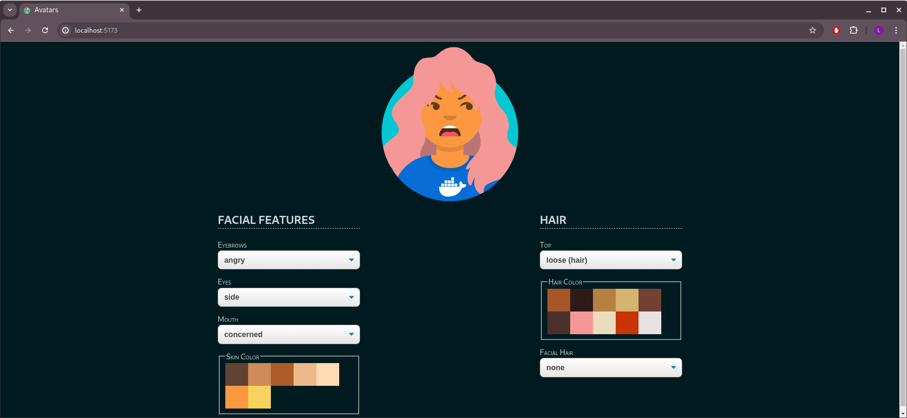

---
2. **Continuous Integration / Continuous Deployment (CI/CD):**

Archivo: ***terraform.yaml***

*En este codigo, almacenado en la carpeta "*github/workflow*", funciona el pipeline para la creacion de los contenedores, revision de seguridad de los mismos, y la ejecución de terraform bajo LocalStack

Primero se define el nombre del pipeline y que se ejecutara cuando haya un push hacia el repositorio*

```
name: CI/CD Proyecto Avatares

on:
  push:
    branches:
      - 'main'
```
*Luego creara una imagen de Linux, donde correra el proyecto. Iniciara sesion en DockerHub con las credenciales almacenadas en los secretos de GitHub, pasando los parametros solicitados de manera segura. Luego creara las imagenes de API y WEB de las carpetas del proyecto, subiendola al repositorio de DockerHub*
```
jobs:
  build-and-push:
    runs-on: ubuntu-latest
    steps:
      - name: Checkout code
        uses: actions/checkout@v4

      - name: Set up QEMU
        uses: docker/setup-qemu-action@v3

      - name: Set up Docker Buildx
        uses: docker/setup-buildx-action@v3

      - name: Log in to Docker Hub
        uses: docker/login-action@v3
        with:
          username: ${{ secrets.DOCKERHUB_USERNAME }}
          password: ${{ secrets.DOCKERHUB_TOKEN }}

      - name: Build and push backend
        uses: docker/build-push-action@v6
        with:
          context: ./Ejercicio-Docker/api
          push: true
          tags: lsmcba/api:1.0

      - name: Build and push frontend
        uses: docker/build-push-action@v6
        with:
          context: ./Ejercicio-Docker/web
          push: true
          tags: lsmcba/web:1.0
```
*Una vez creadas las imagenes, se instalara Trivy, que verificara por problema de seguridad en las imagenes que vamos a utilizar.*
```
  scan-security:
    runs-on: ubuntu-latest
    needs: build-and-push
    steps:
      - name: Checkout code
        uses: actions/checkout@v4

      - name: Install Trivy
        run: |
          sudo apt-get update
          sudo apt-get install -y wget apt-transport-https gnupg lsb-release
          wget -qO - https://aquasecurity.github.io/trivy-repo/deb/public.key | sudo apt-key add -
          echo deb https://aquasecurity.github.io/trivy-repo/deb $(lsb_release -sc) main | sudo tee -a /etc/apt/sources.list.d/trivy.list
          sudo apt-get update
          sudo apt-get install -y trivy

      - name: Scan backend image
        run: trivy image lsmcba/api:1.0

      - name: Scan frontend image
        run: trivy image lsmcba/web:1.0
```
*Cuando las imagenes fueron comprobadas que no tienen problema de seguridad, comenzara con el despliegue nuevamente, cargando las imagenes WEB y API a partir de DockerHUB, el cual utilizara las variables almacenadas en GitHub, todo bajo de Trivy nuevamente.*
```

  deploy:
    runs-on: ubuntu-latest
    needs: scan-security
    services:
      docker:
        image: docker:20.10.7
        options: --privileged

    steps:
      - name: Checkout code
        uses: actions/checkout@v4

      - name: Set up QEMU
        uses: docker/setup-qemu-action@v3

      - name: Set up Docker Buildx
        uses: docker/setup-buildx-action@v3

      - name: Log in to Docker Hub
        uses: docker/login-action@v3
        with:
          username: ${{ secrets.DOCKERHUB_USERNAME }}
          password: ${{ secrets.DOCKERHUB_TOKEN }}
```
*Una vez que realizo la conexion de DockerHUB comenzara la instalacion de terraform, que permitira ejecutar el archivo main.tf, ubicada en la raiz del proyecto. Lo inicializa y lo aplica. Luego lista los contenedores de Docker que esten levantado y funcionando. Como corre en un entorno local, es destruido cuando finaliza. En caso de conseguir credito para AWS, se modificara para que lo ejecute alli*
```

      - name: Install Terraform
        run: |
          sudo apt-get update && sudo apt-get install -y wget unzip
          wget https://releases.hashicorp.com/terraform/1.0.11/terraform_1.0.11_linux_amd64.zip
          unzip terraform_1.0.11_linux_amd64.zip
          sudo mv terraform /usr/local/bin/

      - name: Initialize Terraform
        run: terraform init
        working-directory: .

      - name: Apply Terraform
        run: terraform apply -auto-approve
        working-directory: .

      - name: List Docker Containers
        run: docker ps
```
---
**Demostración**

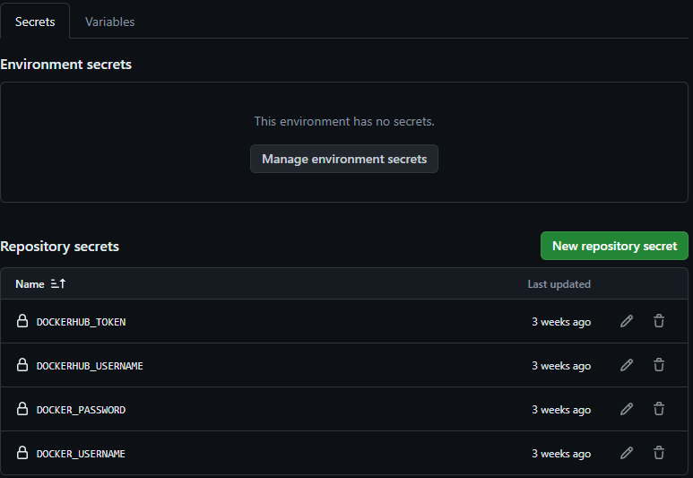 

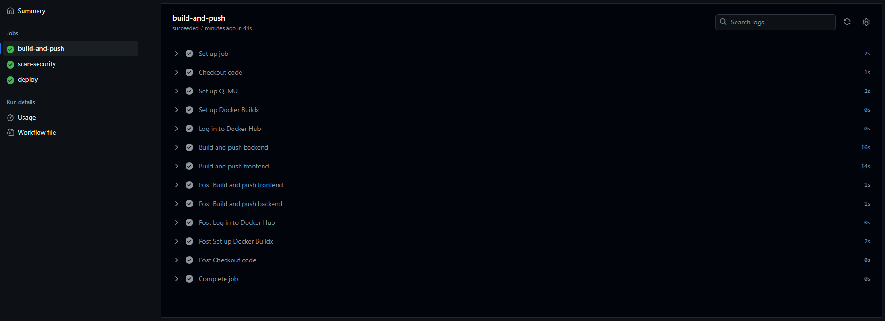

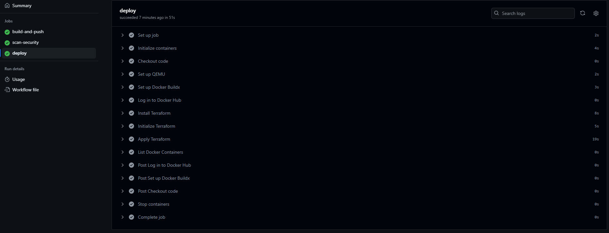

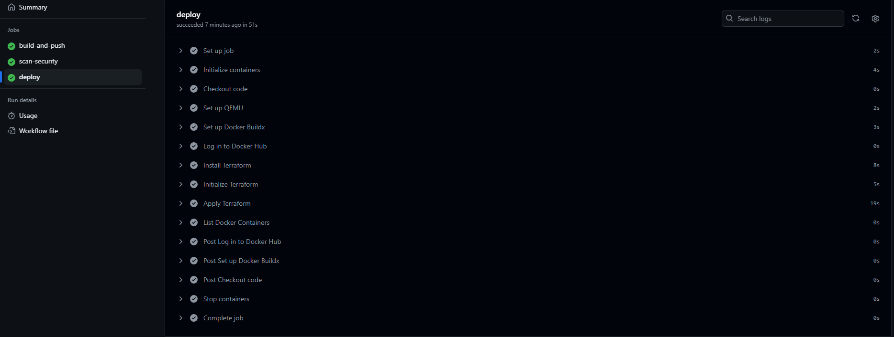

*Se agrega un video demostrativo*

[Enlace] (https://1drv.ms/v/s!AuPeivI2vXtPg4wpm4Azypia6S--lw?e=C75N0z)

---
3. **Contenedores:**

*En este paso, se mostrara los archivos Dockerfile para la creacion de las imagenes de la API y de la WEB, como tambien el push que se realiza a DockerHUB y luego la ejecucion de docker-compose.*

Archivo : ***Dockerfile para la API***

*Para la API, se necesita una imagen de Python, version 3.10 (solicitada en el inicio del proyecto). Luego se establece una carpeta de trabajo donde se copiara y ejecutara la aplicación de Python. Dicha carpeta se llama /app, el cual se copia primero el archivo requeriment.txt, que contendra las librerias necesarias para la ejecucion del codigo. Luego se ejecuta el archivo .txt instalando las librerias, luego se copia todo el contenido de la carpeta API a la carpeta /app y luego se ejcuta por medio de flask, pasandole las variables de ejecucion*

```
FROM python:3.10
WORKDIR /app
COPY requirements.txt requirements.txt
RUN pip install --no-cache-dir -r requirements.txt
COPY . .
CMD ["flask","run","--host","0.0.0.0","--port","80"]
```
Archivo : ***Dockerfile para la API***

*Para la WEB, se necesita una imagen de NodeJS Vesion 18 (solicitada en el inicio del proyecto). Luego se establece una carpeta de trabajo, llamada /app, se copia el archivo package.json, que contiene el paquete a instalar para su funcionamiento. Cuando se termino de instalar, por medio de npm install, se copiara todo el contenido de la carpeta web a la carpeta /app del contenedor, y luego se ejecuta por medio de variables que se pasan en la ultima linea CMD*

```
FROM node:18
WORKDIR /app
COPY package*.json .
RUN npm install
COPY . .
CMD ["npm","run","dev"]
```
Archivo : ***Docker-Compose para la ejecucion de los contenedores***

*En caso que los contenedores no esten creados, los genera a partir de la linea ***build***, el cual, a partir del context, ingresa a cada carpeta (API y WEB) y ejecuta el dockerfile de cada uno, generando cada imagen. En ambos casos (de que se genere o ya existan en el repositorio de imagenes local), se pasan los variables que se solicito al inicio del proyecto, en el caso de la API, se pasa la aplicacion que va a correr FLASK y en donde va a ejecutarse, tambien se establece que funcionara en el puerto 80.*
```
version: "3.8"

services:
  api:
    build:
      context: ./api
      dockerfile: Dockerfile
    ports:
     - 80:80
    networks:
      - proyecto-avatares
    environment:
      - FLASK_APP=app.py
      - FLASK_ENV=development
```
*En el contenedor web, se pasara variables VITE_HOST y VITE_PORT, estableciendo tambien el puerto donde trabajara, pero en este caso, se establecera que el contenedor WEB dependa del contenedor API*
```
  web:
    build:
      context: ./web
      dockerfile: Dockerfile
    ports:
      - 5173:5173
    environment:
      - VITE_HOST=0.0.0.0
      - VITE_PORT=5173
    networks:
      - proyecto-avatares
    depends_on:
      - api
```
*En ambos casos, los contenedores funcionan en una red llamada "proyecto-avatares", el cual esta configurado en modo bridge*
```
networks:
  proyecto-avatares:
    driver: bridge
```

Archivo : ***ejecutar.sh para la creacion de las imagenes, subirlas a DockerHUB y correr Docker-Compose***

*Este bash simplifica la creacion, subida y ejecucion de los contenedores.

En primer caso se inicializa el bash, estableciendo las variables con los colores a utilizar, y la limpieza de las variables usuarios y clave que se utilizaran despues*

```
#!/bin/bash

Red='\033[0;31m'    
Green='\033[0;32m'  
Yellow='\033[0;33m' 
White='\033[0;97m'

clear
unset usuario
unset clave
```
*Para que sea reutilizable el codigo, se creo esta seccion que pide el usuario y contraseña de DockerHUB. La clave se muestra con asteriscos al escribirla. En caso que este todo bien, genera las imagenes y despues la sube*
```
echo -e "${Green}-----------------------------------------------${Color_off}"
echo -e "${Green}Ingrese su Usuario y contraseña de DockerHub...${Color_off}"
echo -e "${Green}-----------------------------------------------${Color_off}"
echo
echo -e "${Yellow}Usuario: ${Color_off}"
read usuario
echo
PROMPT="Contraseña: "
while IFS= read -p "$PROMPT" -r -s -n 1 char; do
    if [[ $char == $'\0' ]]; then
        break
    fi
    PROMPT='*'
    clave+="$char"
done
echo
docker login -p $clave -u $usuario
echo
echo
echo -e "${White}-----------------------------${Color_off}"
echo -e "${Green}Creando imagenes Web y Api...${Color_off}"
echo -e "${White}-----------------------------${Color_off}"
echo
docker build -t $usuario/api:1.0 ./api
echo
docker build -t $usuario/web:1.0 ./web
echo
echo
echo -e "${White}------------------------------------------${Color_off}"
echo -e "${Green}Subiendo imagenes Web y Api a DockerHub...${Color_off}"
echo -e "${White}------------------------------------------${Color_off}"
echo
docker push $usuario/api:1.0
echo
docker push $usuario/web:1.0
echo
echo
```
*Despues que termino de subir las imagenes, se ejecutara el Docker-Compose*
```
echo -e "${White}------------------------------------------------------------------------${Color_off}"
echo -e "${Green}Imagenes creadas y subidas al repositorio, ejecutando docker-compose...${Color_off}"
echo -e "${White}------------------------------------------------------------------------${Color_off}"
echo
docker-compose up -d --build
echo
```
---
**Demostración**

*Aca se muestra la ejecucion manual de Docker-Compose para demostrar que levanta sin problemas*
```
$ docker-compose up      
Creating network "ejercicio-docker_proyecto-avatares" with driver "bridge"
Creating ejercicio-docker_api_1 ... done
Creating ejercicio-docker_web_1 ... done
Attaching to ejercicio-docker_api_1, ejercicio-docker_web_1
api_1  |  * Serving Flask app 'app.py' (lazy loading)
api_1  |  * Environment: development
api_1  |  * Debug mode: on
api_1  |  * Debugger is active!
api_1  |  * Debugger PIN: 253-648-446
web_1  | 
web_1  | > web@0.0.1 dev
web_1  | > vite
web_1  | 
web_1  | 
web_1  |   VITE v4.5.3  ready in 279 ms
web_1  | 
web_1  |   ➜  Local:   http://localhost:5173/
web_1  |   ➜  Network: http://172.20.0.3:5173/
```
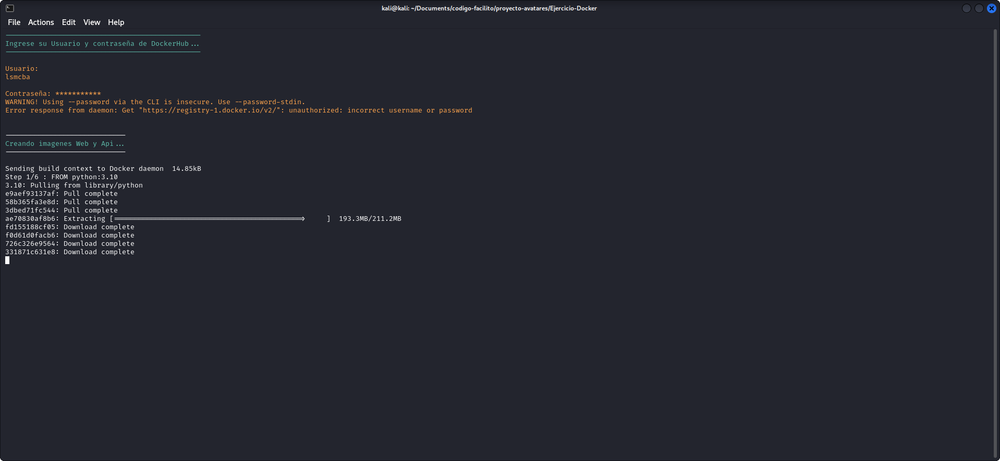

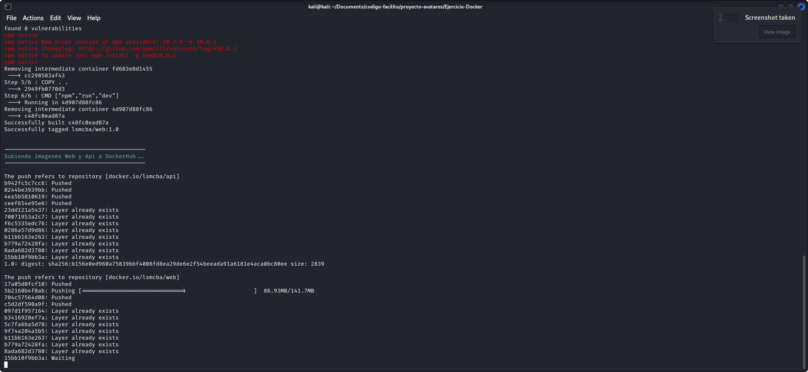

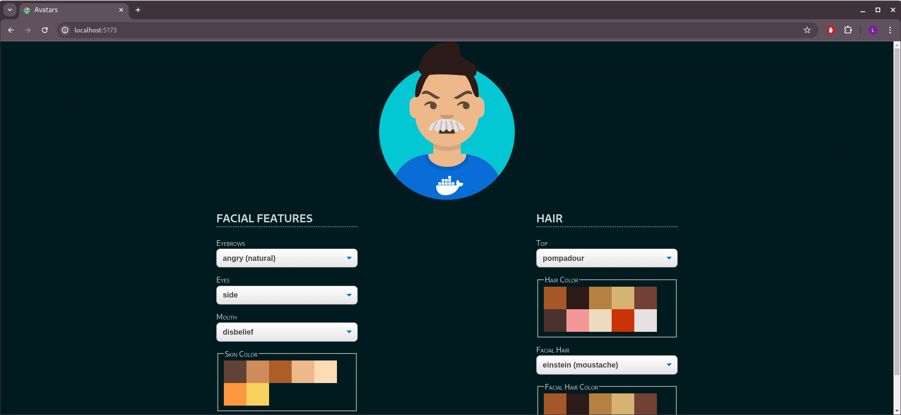


---
4. **Orquestación de Contenedores con Kubernetes:**

*En este paso, se demostrara el funcionamiento de kubernetes, por medio de minikube. Algunos codigos para las metricas, fueron descargadas del repositorio ***https://github.com/kubernetes/kube-state-metrics/tree/main/examples/daemonsetsharding***, y dicho codigo no seran agregados a la explicacion, ya que son muy largos, ademas fueron copiados para poder ejecutar el contenedor de las metricas*

Archivo : ***backend-deploy.yaml***

*En primer se crea un pod que servira como deployment, con replica en 1 (ya que no hacia falta mas, pero si era necesario, se podria probar con mas). En este caso sera del contenedor API, que correra en en namespace "proyecto avatares". Descarga la imagen de DockerHUB y establece un limite de recursos, para que no consuma mas de lo que necesita. Correra en el puerto 80, y se le pasa las variables para su ejecucion*

```
apiVersion: apps/v1
kind: Deployment
metadata:
  name: api
  namespace: proyecto-avatares
spec:
  replicas: 1
  selector:
    matchLabels:
      app: api
  template:
    metadata:
      labels:
        app: api
    spec:
      containers:
      - name: api
        image: lsmcba/api:1.0
        resources:
          limits:
            memory: "128Mi"
            cpu: "500m"
        ports:
        - containerPort: 80
        env:
        - name: FLASK_APP
          value: "app.py"
        - name: FLASK_ENV
          value: "development"
```
*En este caso se crea un servicio de la API, que correra en el nodePort 30080, para que otros nodos puedan acceder a el*
```
---
apiVersion: v1
kind: Service
metadata:
  name: api
  namespace: proyecto-avatares
spec:
  selector:
    app: api
  ports:
    - protocol: TCP
      port: 80
      targetPort: 80
      nodePort: 30080
  type: NodePort
```
Archivo : ***frontend-deploy.yaml***

*Como en el caso anterior, se crea un Deployment, con replica en 1. Se descarga la imagen WEB de DockerHUB, y se establece los recursos maximos a utilizar. Se pasan las variables necesarias para su ejecucion*
```
apiVersion: apps/v1
kind: Deployment
metadata:
  name: web
  namespace: proyecto-avatares
spec:
  replicas: 1
  selector:
    matchLabels:
      app: web
  template:
    metadata:
      labels:
        app: web
    spec:
      containers:
      - name: web
        image: lsmcba/web:1.0
        resources:
          limits:
            memory: "128Mi"
            cpu: "500m"
        ports:
        - containerPort: 5173
        env:
        - name: VITE_HOST
          value: "0.0.0.0"
        - name: VITE_PORT
          value: "5173"
---
```
*Tambien se crea un servicio con el puerto 30173 dentro del namespace "proyecto-avatares"*
```
apiVersion: v1
kind: Service
metadata:
  name: web
  namespace: proyecto-avatares
spec:
  selector:
    app: web
  ports:
    - protocol: TCP
      port: 5173
      targetPort: 5173
      nodePort: 30173
  type: NodePort
```
Archivo : ***namespace.yaml***

*Este archivo solo creara el namespace que se utilizara en todo el proyecto*

```
apiVersion: v1
kind: Namespace
metadata:
  name: proyecto-avatares
```

Archivo : ***prometheus-deploy.yaml***

*Este archivo crea un pod declarado como Deployment para la ejecucion de Prometheus, que recolectara las metricas para el control de los pods. Tambien esta seteado para 1 replica, descarga la imagen de DockerHUB y lo establece en el puerto 9090. Pasa como argumento la ubicacion a donde ira el archivo de configuracion y establece los limites de los recursos a utilizar.*

```
apiVersion: apps/v1
kind: Deployment
metadata:
  name: prometheus
  namespace: proyecto-avatares
  labels:
    app: prometheus
spec:
  replicas: 1
  selector:
    matchLabels:
      app: prometheus
  template:
    metadata:
      labels:
        app: prometheus
    spec:
      containers:
      - name: prometheus
        image: prom/prometheus:latest
        ports:
        - containerPort: 9090
        args:
          - "--config.file=/etc/prometheus/prometheus.yml"
        resources:
          requests:
            memory: "256Mi"
            cpu: "250m"
          limits:
            memory: "512Mi"
            cpu: "500m"
        volumeMounts:
        - name: prometheus-config
          mountPath: /etc/prometheus
      volumes:
      - name: prometheus-config
        configMap:
          name: prometheus-configuracion

---
```
*Esta parte configura al POD para usar ConfigMap, para su inicializacion. Se establece el mismo namespace donde estan todos los demas pods, el intervalo de actualizacion y luego el job, que define de donde va a obtener las metricas y la ip del cluster para obtenerlas. Se intento de poner el nombre del pod, pero siempre dio error, no resuelve los nombres. Por el tiempo de la entrega, se la deja con la IP que me genero en mi maquina*

```
apiVersion: v1
kind: ConfigMap
metadata:
  name: prometheus-configuracion
  namespace: proyecto-avatares
data:
  prometheus.yml: |
    global:
      scrape_interval: 15s
    scrape_configs:
      - job_name: 'kube-state-metrics'
        honor_timestamps: true
        metrics_path: /metrics
        scheme: http
        static_configs:
          - targets: ['192.168.49.2:31081']
        metric_relabel_configs:
          - target_label: cluster
            replacement: prometheus
            
```
*Lo mismo que en los casos anteriores, se genera un servicio que expone el puerto 30900 para que los demas pods puedan verlo. Hara falta para vincularlo con Grafana.*
```
---
apiVersion: v1
kind: Service
metadata:
  name: prometheus
  namespace: proyecto-avatares
  labels:
    app: prometheus
spec:
  type: NodePort
  ports:
    - port: 9090
      targetPort: 9090
      nodePort: 30900
  selector:
    app: prometheus
```

Archivo : ***grafana-deploy.yaml***

*Grafana nos permitira ver las metricas obtenidas de Prometheus de manera grafica, mas entendible*

*Como los archivos anteriores, se configura el POD como deployment primero, se establece la replica en 1 y se descarga la imagen oficial de Grafana. Se establece el puerto 3000 y se pasa las variables para setear el usuario y contraseña para acceder. Se establece los limites de recursos que puede utilizar*

```
apiVersion: apps/v1
kind: Deployment
metadata:
  name: grafana
  namespace: proyecto-avatares
  labels:
    app: grafana
spec:
  replicas: 1
  selector:
    matchLabels:
      app: grafana
  template:
    metadata:
      labels:
        app: grafana
    spec:
      containers:
      - name: grafana
        image: grafana/grafana:latest
        ports:
        - containerPort: 3000
        env:
        - name: GF_SECURITY_ADMIN_USER
          value: "admin"
        - name: GF_SECURITY_ADMIN_PASSWORD
          value: "admin"
        resources:
          requests:
            memory: "256Mi"
            cpu: "250m"
          limits:
            memory: "512Mi"
            cpu: "500m"
```
*Como en los casos anteriores, se configura el servicio del mismo para el puerto sea 32000, asi pueda ser accedido fuera del cluster*
```
---
apiVersion: v1
kind: Service
metadata:
  name: grafana
  namespace: proyecto-avatares
  labels:
    app: grafana
spec:
  type: NodePort
  ports:
    - port: 3000
      targetPort: 3000
      nodePort: 32000
  selector:
    app: grafana
```
Archivo : ***cluster-role-binding.yaml***

*Otorga los permisos para visualizar las metricas*

```
apiVersion: rbac.authorization.k8s.io/v1
kind: ClusterRoleBinding
metadata:
  labels:
    app.kubernetes.io/component: exporter
    app.kubernetes.io/name: kube-state-metrics
    app.kubernetes.io/version: 2.12.0
  name: kube-state-metrics
roleRef:
  apiGroup: rbac.authorization.k8s.io
  kind: ClusterRole
  name: kube-state-metrics
subjects:
- kind: ServiceAccount
  name: kube-state-metrics
  namespace: proyecto-avatares
```
Archivo : ***cluster-role.yaml***

*Contiene los roles a los cuales se le otorga los permisos*

```
apiVersion: rbac.authorization.k8s.io/v1
kind: ClusterRole
metadata:
  labels:
    app.kubernetes.io/component: exporter
    app.kubernetes.io/name: kube-state-metrics
    app.kubernetes.io/version: 2.12.0
  name: kube-state-metrics
  namespace: proyecto-avatares
rules:
- apiGroups:
  - ""
  resources:
  - configmaps
  - secrets
  - nodes
  - pods
  - services
  - serviceaccounts
  - resourcequotas
  - replicationcontrollers
  - limitranges
  - persistentvolumeclaims
  - persistentvolumes
  - namespaces
  - endpoints
  verbs:
  - list
  - watch
- apiGroups:
  - apps
  resources:
  - statefulsets
  - daemonsets
  - deployments
  - replicasets
  verbs:
  - list
  - watch
- apiGroups:
  - batch
  resources:
  - cronjobs
  - jobs
  verbs:
  - list
  - watch
- apiGroups:
  - autoscaling
  resources:
  - horizontalpodautoscalers
  verbs:
  - list
  - watch
- apiGroups:
  - authentication.k8s.io
  resources:
  - tokenreviews
  verbs:
  - create
- apiGroups:
  - authorization.k8s.io
  resources:
  - subjectaccessreviews
  verbs:
  - create
- apiGroups:
  - policy
  resources:
  - poddisruptionbudgets
  verbs:
  - list
  - watch
- apiGroups:
  - certificates.k8s.io
  resources:
  - certificatesigningrequests
  verbs:
  - list
  - watch
- apiGroups:
  - discovery.k8s.io
  resources:
  - endpointslices
  verbs:
  - list
  - watch
- apiGroups:
  - storage.k8s.io
  resources:
  - storageclasses
  - volumeattachments
  verbs:
  - list
  - watch
- apiGroups:
  - admissionregistration.k8s.io
  resources:
  - mutatingwebhookconfigurations
  - validatingwebhookconfigurations
  verbs:
  - list
  - watch
- apiGroups:
  - networking.k8s.io
  resources:
  - networkpolicies
  - ingressclasses
  - ingresses
  verbs:
  - list
  - watch
- apiGroups:
  - coordination.k8s.io
  resources:
  - leases
  verbs:
  - list
  - watch
- apiGroups:
  - rbac.authorization.k8s.io
  resources:
  - clusterrolebindings
  - clusterroles
  - rolebindings
  - roles
  verbs:
  - list
  - watch
```
Archivo : ***cluster-role.yaml***

*En este caso, se utiliza la imagen de "kube-static-metrics", que permite obtener todas las metricas que se utilizaran para monitorear los recursos de Kubernetes. Se publicara en el puerto 30081 para que pueda ser agregado en Prometheus*

```
metadata:
  labels:
    app.kubernetes.io/component: exporter
    app.kubernetes.io/name: kube-state-metrics
    app.kubernetes.io/version: 2.12.0
  name: kube-state-metrics
  namespace: proyecto-avatares
spec:
  replicas: 1
  selector:
    matchLabels:
      app.kubernetes.io/name: kube-state-metrics
  template:
    metadata:
      labels:
        app.kubernetes.io/component: exporter
        app.kubernetes.io/name: kube-state-metrics
        app.kubernetes.io/version: 2.12.0
    spec:
      automountServiceAccountToken: true
      containers:
      - image: registry.k8s.io/kube-state-metrics/kube-state-metrics:v2.12.0
        livenessProbe:
          httpGet:
            path: /livez
            port: 8080
          initialDelaySeconds: 5
          timeoutSeconds: 5
        name: kube-state-metrics
        ports:
        - containerPort: 8080
          name: http-metrics
        - containerPort: 8081
          name: telemetry
        resources:
            requests:
              memory: 64Mi
              cpu: 50m
            limits:
              memory: 128Mi
              cpu: 100m        
        readinessProbe:
          httpGet:
            path: /metrics
            port: 8081
          initialDelaySeconds: 5
          timeoutSeconds: 5
        securityContext:
          allowPrivilegeEscalation: false
          capabilities:
            drop:
            - ALL
          readOnlyRootFilesystem: true
          runAsNonRoot: true
          runAsUser: 65534
          seccompProfile:
            type: RuntimeDefault
      nodeSelector:
        kubernetes.io/os: linux
      serviceAccountName: kube-state-metrics

---

apiVersion: v1
kind: Service
metadata:
  labels:
    app.kubernetes.io/component: exporter
    app.kubernetes.io/name: kube-state-metrics
    app.kubernetes.io/version: 2.12.0
  name: kube-state-metrics
  namespace: proyecto-avatares
spec:
  type: NodePort
  ports:
  - name: http-metrics
    port: 8080
    targetPort: http-metrics
    nodePort: 31080
  - name: telemetry
    port: 8081
    targetPort: telemetry
    nodePort: 31081
  selector:
    app.kubernetes.io/name: kube-state-metrics
```
Archivo : ***service-Account.yaml***
```
apiVersion: v1
automountServiceAccountToken: false
kind: ServiceAccount
metadata:
  labels:
    app.kubernetes.io/component: exporter
    app.kubernetes.io/name: kube-state-metrics
    app.kubernetes.io/version: 2.12.0
  name: kube-state-metrics
  namespace: proyecto-avatares
```
Archivo : ***ejecutar.sh***

*Este bash ejecuta todos los archivos involucrados en el ejercicio de Kubernetes*

```
#!/bin/bash

kubectl apply -f namespace.yaml
kubectl apply -f backend-deploy.yaml
kubectl apply -f frontend-deploy.yaml
kubectl apply -f grafana-deploy.yaml
kubectl apply -f prometheus-deploy.yaml
kubectl apply -f kube-metric-deploy.yaml
kubectl apply -f cluster-role.yaml
kubectl apply -f cluster-role-binding.yaml
kubectl apply -f service-account.yaml
```
---

**Demostración**

```
$ ./ejecutar.sh 
namespace/proyecto-avatares created
deployment.apps/api created
service/api created
deployment.apps/web created
service/web created
deployment.apps/grafana created
service/grafana created
deployment.apps/prometheus created
configmap/prometheus-configuracion created
service/prometheus created
deployment.apps/kube-state-metrics created
service/kube-state-metrics created
clusterrole.rbac.authorization.k8s.io/kube-state-metrics created
clusterrolebinding.rbac.authorization.k8s.io/kube-state-metrics created
serviceaccount/kube-state-metrics created
```
```
$ kubectl get pods  -n proyecto-avatares
NAME                                  READY   STATUS    RESTARTS   AGE
api-cb94bd485-htfkj                   1/1     Running   0          72s
grafana-847d64b477-znbsq              1/1     Running   0          72s
kube-state-metrics-65cf87779b-hqvbq   1/1     Running   0          71s
prometheus-7fcb5d4bf8-9d7hz           1/1     Running   0          72s
web-7c8dd87f67-zcxkp                  1/1     Running   0          72s
```

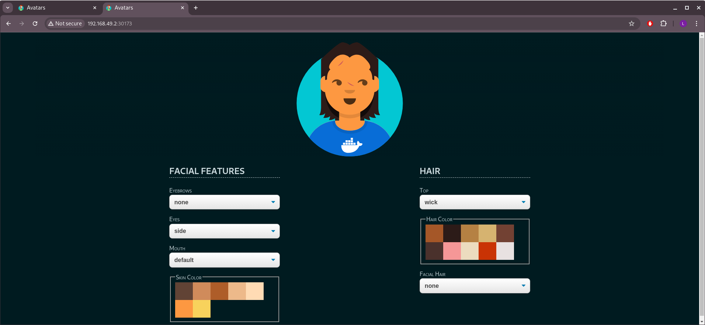

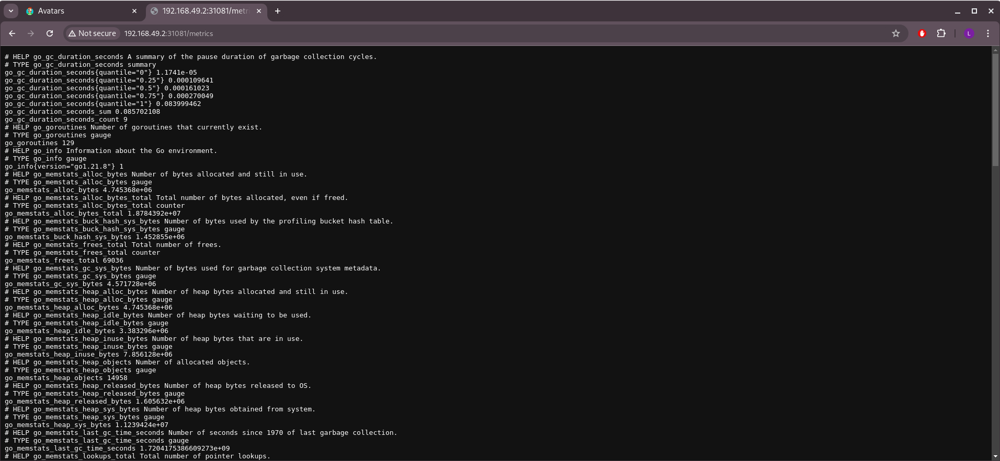

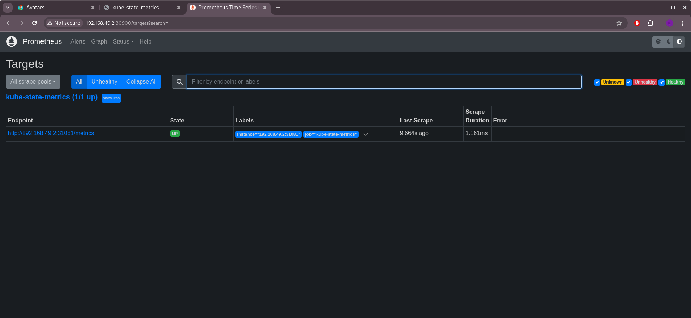

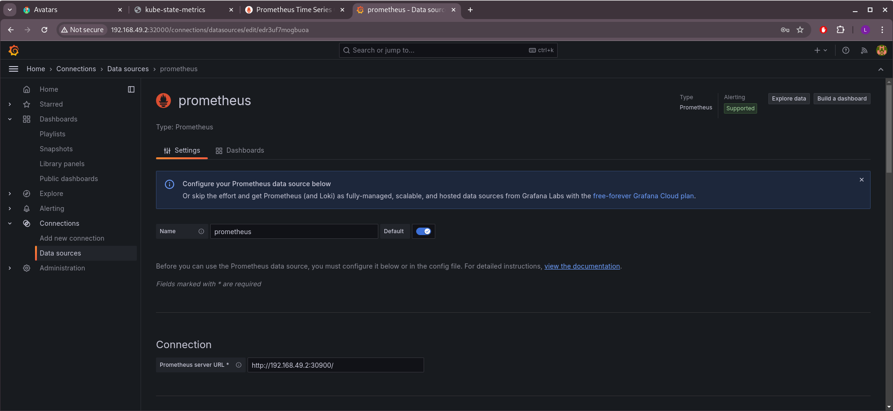

*En este dashboard deberia mostrar las metricas requeridas, pero por alguna razon el kube-metric no me trae esas consultas. Por falta de tiempo, la entrego con esa falla, espero solucionarla pronto*

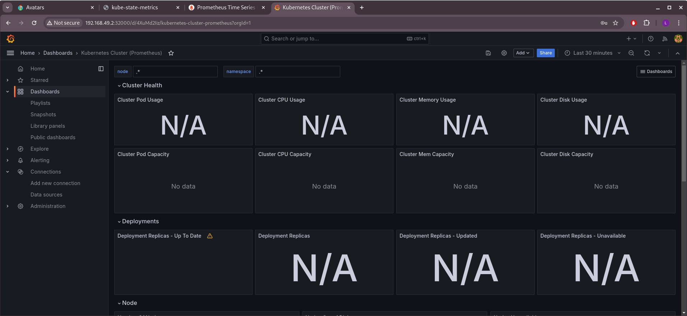


